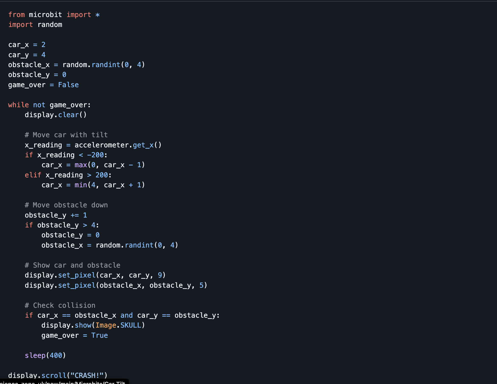

# 🚗 **Micro:bit Game: Tilt Car**

---

## 🎯 **Learning Objectives (Bloom’s Taxonomy)**

| Bloom’s Level        | Learning Objective                                                                              |
| -------------------- | ----------------------------------------------------------------------------------------------- |
| 🔵 **Remembering**   | Pupils will be able to **identify** what an accelerometer does on the Micro:bit.                |
| 🟢 **Understanding** | Pupils will be able to **explain** how tilting the Micro:bit can move an object on screen.      |
| 🟡 **Applying**      | Pupils will be able to **use** accelerometer readings to control a car’s movement.              |
| 🟠 **Analysing**     | Pupils will be able to **compare** how different tilts change gameplay speed or direction.      |
| 🔴 **Evaluating**    | Pupils will be able to **test** their car control and adjust sensitivity for smoother movement. |
| 🟣 **Creating**      | Pupils will be able to **design** their own obstacle or track version of the tilt car game.     |

---

## 🏁 **Game Description**

In the **Tilt Car Game**, the player moves a “car” (a pixel) along the bottom row of the Micro:bit LED display.
The car moves **left or right** when you tilt the Micro:bit.
Obstacles fall from the top — avoid them to survive as long as possible! 💥

---

## 🕹️ **Lesson Flow (Teacher Guide)**

---

### 1️⃣ **Introduction (10 mins)**

💬 **Ask Students:**

* How do racing or driving games work?
* What happens when you tilt your phone or tablet to steer?
* Did you know the Micro:bit can sense tilt using a special sensor called an **accelerometer**?

📌 **Explain:**
We’ll build a **Tilt Car Game** where your Micro:bit becomes the steering wheel!
You’ll tilt left or right to dodge falling obstacles.

---

### 2️⃣ **The Problem (5 mins)**

We need to build a Micro:bit game that:

* Moves a “car” left or right using the accelerometer 🚗
* Spawns random obstacles at the top of the screen
* Detects collisions
* Ends the game if you crash 💥

💬 **Discussion Prompt:**

* How can we tell when two things are in the same place?
* How can we make the game more challenging?

---

## 🧠 **Step-by-Step Coding Guide**

---

✅ **Step 1: Import Modules**

```python
from microbit import *
import random
```

We’ll need:

* `microbit` for display and accelerometer
* `random` for obstacle positions

---

✅ **Step 2: Set Starting Positions**

```python
car_x = 2  # start in the middle (x-axis)
car_y = 4  # bottom row
obstacle_x = random.randint(0, 4)
obstacle_y = 0
game_over = False
```

💡 The car starts centered on the bottom row. The obstacle starts randomly at the top.

---

✅ **Step 3: Move Car with Tilt**

```python
x_reading = accelerometer.get_x()

if x_reading < -200:
    car_x = max(0, car_x - 1)
elif x_reading > 200:
    car_x = min(4, car_x + 1)
```

💡 Tilting left moves the car left, tilting right moves it right.

---

✅ **Step 4: Move Obstacle Downward**

```python
obstacle_y += 1
if obstacle_y > 4:
    obstacle_y = 0
    obstacle_x = random.randint(0, 4)
```

💡 The obstacle “falls” one row per loop.

---

✅ **Step 5: Check for Collision**

```python
if car_x == obstacle_x and car_y == obstacle_y:
    display.show(Image.SKULL)
    game_over = True
```

💡 If both occupy the same position, the game ends.

---

✅ **Step 6: Show Everything on Screen**

```python
display.clear()
display.set_pixel(car_x, car_y, 9)
display.set_pixel(obstacle_x, obstacle_y, 5)
```

💡 Bright car and dimmer obstacle for visual contrast.

---

✅ **Step 7: Full Code**




---

## 🧩 **Extension Challenges**

---

### ⚡ **Challenge 1: Increase Speed**

Make the game faster each round:

```python
sleep_time = max(100, 400 - score * 10)
sleep(sleep_time)
```

---

### 🚧 **Challenge 2: Multiple Obstacles**

Add a list of falling obstacles for extra challenge:

```python
obstacles = [[random.randint(0,4), 0], [random.randint(0,4), 2]]
```

---

### 🎵 **Challenge 3: Add Sounds**

Play a sound on crash:

```python
import music
music.play(['C5:1', 'B4:1', 'A4:2'])
```

---

### 🧠 **Challenge 4: Add a Score**

Count how long the player survives:

```python
score += 1
display.scroll(str(score))
```

---

### 🎨 **Challenge 5: Create Levels**

Speed up after a certain score or make new patterns of obstacles.

---

## 💬 **Reflection Questions**

* How does the accelerometer detect tilt?
* What happens when you change the tilt sensitivity?
* How could you make your game multiplayer?

---

## ✅ **Wrap-Up**

By the end of this lesson, students can:

* Use the **accelerometer** to detect motion
* Apply **loops and conditions** for continuous movement
* Display moving objects using LED coordinates
* Create a complete **Tilt Car Game** with collisions and feedback

---
