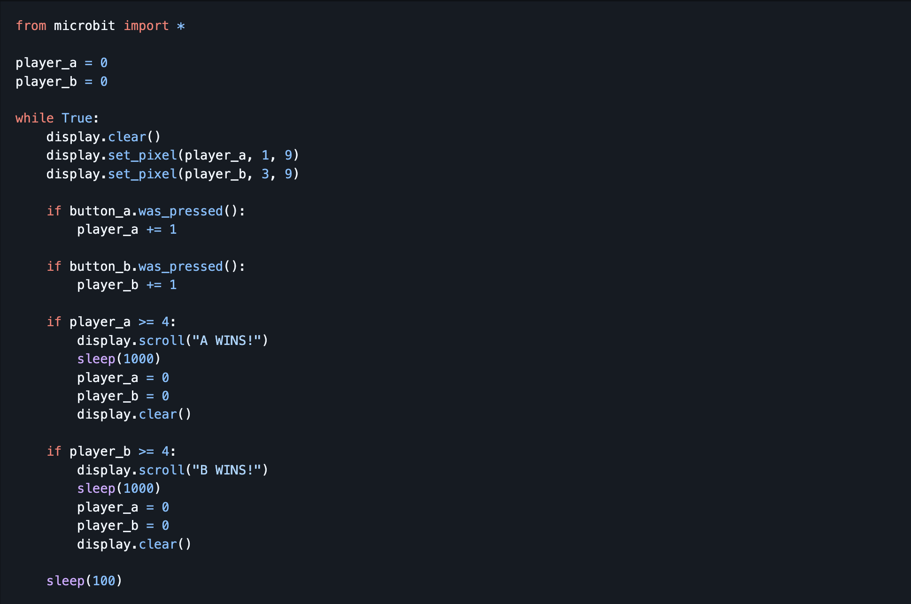

# 🏁 **Micro:bit Game: Race Game**

---

## 🎯 **Learning Objectives (Bloom’s Taxonomy)**

| Bloom’s Level        | Learning Objective                                                                                        |
| -------------------- | --------------------------------------------------------------------------------------------------------- |
| 🔵 **Remembering**   | Pupils will be able to **identify** how button presses work as inputs on the Micro:bit.                   |
| 🟢 **Understanding** | Pupils will be able to **explain** how button presses can move a racer across the LED grid.               |
| 🟡 **Applying**      | Pupils will be able to **use** loops and variables to move racers and track progress.                     |
| 🟠 **Analysing**     | Pupils will be able to **compare** which strategies or button speeds win the race.                        |
| 🔴 **Evaluating**    | Pupils will be able to **judge** fairness and balance in their race mechanics.                            |
| 🟣 **Creating**      | Pupils will be able to **design** their own race variations — adding levels, power-ups, or speed effects. |

---

## 🕹️ **Game Description**

Two players race by pressing **Button A** or **Button B** as fast as they can!
Each button press moves that player’s “car” one step forward across the LED grid.
The first to reach the finish line **wins** the race. 🏆

---

## ⏱️ **Lesson Flow (Teacher Guide)**

---

### 1️⃣ **Introduction (10 mins)**

💬 **Ask Students:**

* What kinds of races do you know? (cars, running, swimming, etc.)
* How could we simulate a race on the Micro:bit?
* How could we make it fair for two players?

📌 **Explain:**
Each player has a button — **A for Player 1** and **B for Player 2**.
When you press your button, your “car” moves one LED to the right.
The first player to reach the right edge **wins!**

---

### 2️⃣ **The Problem (5 mins)**

We need to build a **two-player race game** that:

* Starts from the left side of the LED grid 🏁
* Moves the player one step for each button press
* Detects when a player reaches the finish line (far right)
* Displays the winner and restarts the race

💬 **Ask:**

* What variable could we use to track each player’s position?
* How do we know when someone wins?

---

## 🧠 **Step-by-Step Coding Guide**

---

✅ **Step 1: Import Microbit Module**

```python
from microbit import *
```

We only need the Microbit library for buttons and display.

---

✅ **Step 2: Set Starting Positions**

```python
player_a = 0
player_b = 0
```

💡 Each player’s position will be stored as a number (column on the LED grid).

---

✅ **Step 3: Game Loop**

```python
while True:
    display.clear()
    display.set_pixel(player_a, 1, 9)
    display.set_pixel(player_b, 3, 9)
```

💡

* Player A’s car is on **row 1**
* Player B’s car is on **row 3**
* Brightness `9` makes it visible as a racing car

---

✅ **Step 4: Move Players When Buttons Are Pressed**

```python
    if button_a.was_pressed():
        player_a += 1

    if button_b.was_pressed():
        player_b += 1
```

💡 Each button press increases that player’s position.

---

✅ **Step 5: Check for Winner**

```python
    if player_a >= 4:
        display.scroll("A WINS!")
        sleep(1000)
        player_a = 0
        player_b = 0
        display.clear()

    if player_b >= 4:
        display.scroll("B WINS!")
        sleep(1000)
        player_a = 0
        player_b = 0
        display.clear()
```

💡 When a player reaches the right edge (`column 4`), they win, and the game resets.

---

✅ **Step 6: Full Code**



---

## 🧩 **Extension Challenges**

---

### 🚀 **Challenge 1: Add a Starting Countdown**

Add a dramatic “3, 2, 1, GO!” before the race starts:

```python
for i in range(3, 0, -1):
    display.show(str(i))
    sleep(500)
display.scroll("GO!")
```

---

### 🎶 **Challenge 2: Add Sound Effects**

Play sounds when cars move or win (if your Micro:bit v2 has sound):

```python
import music
music.play(['C4:1'])
```

---

### ⚡ **Challenge 3: Add Obstacles**

Randomly “block” one position to make players slow down.

Hint: Use a random number generator to pick a blocked column.

---

### 🧠 **Challenge 4: Best of 3 Rounds**

Add a score counter for each player and track who wins first 2 rounds.

---

### 🎨 **Challenge 5: Custom Icons**

Replace pixel dots with icons:

```python
display.show(Image.ARROW_E)
```

---

## 💬 **Reflection Questions**

* How could you make the game fair if one player presses faster?
* What could you add to make it more exciting or random?
* How would you make it single-player?

---

## ✅ **Wrap-Up**

By the end of this lesson, students can:

* Detect button presses
* Use variables to store position
* Display movement on the LED grid
* Create a two-player **Race Game** using logic, loops, and conditions

---
