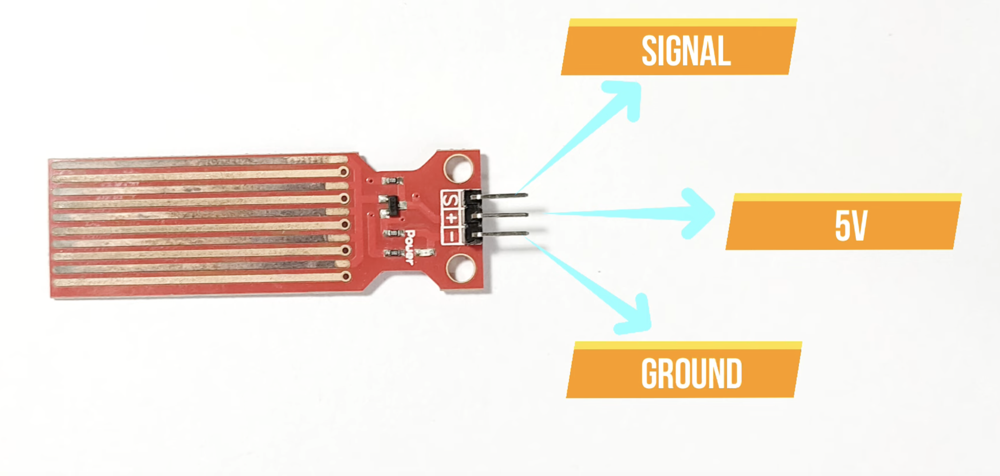
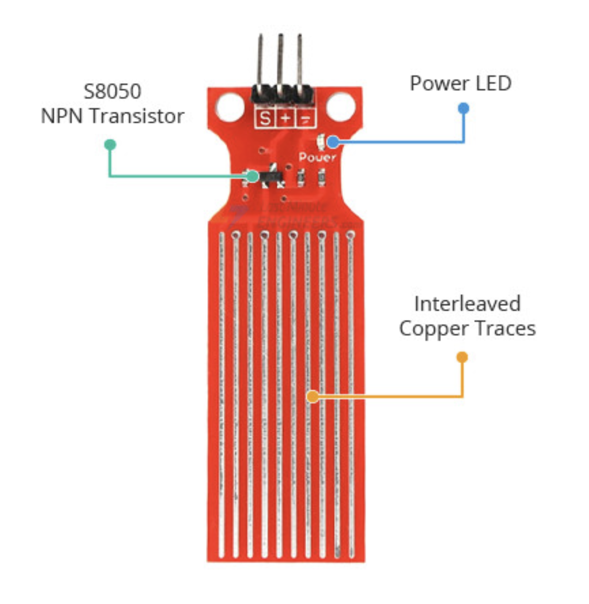
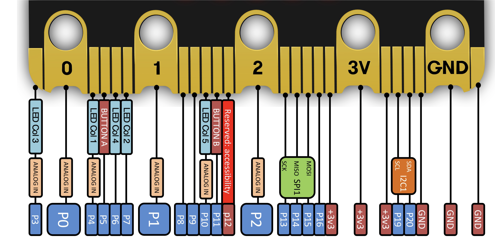

# 💧 Flood Alert Heroes: Code to the Rescue!
## Micro:bit Python Workshop Worksheet  
**Age**: 11+ — **Time**: 1.5 hours

📺 [Water Sensor Explained (YouTube)](https://www.youtube.com/watch?v=Drxf9VuTkPM)  
📚 [Sensor Tutorial (Last Minute Engineers)](https://lastminuteengineers.com/water-level-sensor-arduino-tutorial/)  
🐍 Python Editor: [https://python.microbit.org/v/3](https://python.microbit.org/v/3)  
🧠 MicroPython Help: [https://microbit-micropython.readthedocs.io/en/v2-docs/index.html](https://microbit-micropython.readthedocs.io/en/v2-docs/index.html)  
[Analogue to digital conversion](https://halvorsen.blog/documents/technology/iot/microbit.php)

---
## Objectives:
🧠 Knowledge & Understanding
- Define what a sensor is and explain its role in environmental monitoring
- Understand the difference between digital and analog signals
- Explain how a water level sensor works and how it sends analog voltage
- Understand the concept of analog-to-digital conversion using the micro:bit
- Recognize that 0–3.3V signals are converted to 0–1023 by the micro:bit using binary
- Describe how sensors fit into the Input ➔ Think ➔ Output system in computing


## 🌊 Mission:
Your village is near a river. The rainy season is coming. You’ve been asked to build a **flood warning system** using your Micro:bit and a **water sensor**. Are you ready to become a Flood Alert Hero?

---

## 1. WARM-UP CHALLENGES

### 🟢 Easy: Print "Hello World"
```python
# Print message to serial
print("Hello World")
```

### 🟡 Medium: Display "Hello" on the LED screen
```python
from microbit import *
display.scroll("________")
```

### 🔴 Hard: Countdown then display message
```python
from microbit import *

for i in range(5, 0, -1):
    #Add your code

#Display your message
```

---

## 2. UNDERSTANDING THE TECHNOLOGY

### 👁 What is a Sensor?
Sensors help machines "feel" things like water, light, or sound.

### 🧠 What is a Micro:bit?
A small computer that reads sensors (input), makes decisions, and shows or plays results (output).

### 🧮 INPUT ➔ THINK ➔ OUTPUT
- Sensor: "I'm wet!"
- Micro:bit: "Oh no, it might flood!"
- Output: Flash light or sound alarm

---

## 3. DIGITAL vs ANALOG

### ✉️ Quick Quiz: Circle the type of signal

| Thing           | Digital or Analog? |
|----------------|--------------------|
| Light Switch   | DIGITAL            |
| Volume Knob    | ANALOG             |
| Water Sensor   | ANALOG             |

---

## 4. HOW DOES THE WATER SENSOR WORK?

### 🧪 What It Does
- Water touches the sensor → electricity flows
- More water = more voltage


### 🔢 Analog Values
Your water sensor gives a number between **0** (dry) and **1023** (very wet).

---

## 🧪💧 How Does the Water Sensor Work with the Micro:bit?

### 1️⃣ What the Sensor Does
The **water level sensor** has metal lines. When water touches them, it sends more **electric power** (called **voltage**) to the micro:bit.  
- **No water** = **low voltage**  
- **More water** = **higher voltage**

### 2️⃣ But Micro:bits Don't Understand Volts!
The micro:bit doesn't measure voltage like we do — it **turns voltage into a number**.  
It does this using a special function called **analog read**.

### 3️⃣ The Magic Numbers: 0 to 1023

| Voltage (0–3.3V) | Number it gives you |
|------------------|---------------------|
| 0 volts          | 0                   |
| 1.65 volts       | 512                 |
| 3.3 volts        | 1023                |

So if the sensor gives 2 volts, the micro:bit might show a number like **620**.

### 4️⃣ Why 1023? Why Not Just Use Volts?
Because the micro:bit is a **computer**, and computers **use binary** — just 1s and 0s.

To measure the voltage, it uses **10 binary digits (bits)** like little light switches:
```
0000000000 → 0  
1111111111 → 1023
```

That gives **1024 tiny steps** to measure small changes in voltage.

### 🍫 Chocolate Bar Example
Imagine a chocolate bar cut into **1024 tiny pieces**:
- No water? You get 0 pieces.
- Half full? You get 512 pieces.
- Fully full? You get 1023 pieces!

### ✅ Summary
- Sensor sends **0 to 3.3V**
- Micro:bit turns it into **0 to 1023**
- That number = how wet the sensor is!

---

## 5. SETUP & TESTING THE SENSOR

### 🔌 Wiring:
- **VCC** ➔ 3V  
- **GND** ➔ GND  
- **SIG** ➔ pin0     




### Electrical components
    

### Microbit pins



## 🚧 Project Problem & Requirements

You're building a **smart water monitor** for a plant pot, water tank, or river!  
It should:

- Measure how high the water is
- Print the analog value
- Show a happy face if full, sad face if low
- Let you think about **how to improve it in future**

---

## 🪜 Step-by-Step Activities

### 🔹 Step 1: Connect the Sensor

**Pseudocode:**
- Connect sensor SIG to pin0
- Connect GND and VCC
- Read analog value

```python
from microbit import *

# Read from water level sensor connected to pin0
val = pin0.read_analog()
print(val)
```


### ☑ Test it out:
Try it dry, half-wet, and fully wet.         
🧠 *Q: What range of values do you see when there's no water vs full water?*


| Test          | Sensor Value |
|---------------|---------------|
| Dry Sensor    |               |
| Half Wet      |               |
| Fully Wet     |               |


---

### 🔹 Step 2: Show Different Faces

**Concept:** Use `if` to check value

**Basic Test:**
```python
from microbit import *

val = pin0.read_analog()

if val < 300:
    display.show(Image.SAD)
else:
    display.show(Image.HAPPY)
```

**Scaffolding Options:**

**Easy:**
```python
# Show happy/sad face depending on water level
level = pin0.read_analog()
if level > 500:
    display.show(Image.HAPPY)
else:
    display.show(Image.SAD)
```

**Experienced Pseudocode:**
- Read value
- If value > 500 → happy
- Else → sad

---

### 🔹 Step 3: Add Loop and Live Readings

```python
from microbit import *

while True:
    level = pin0.read_analog()
    print(level)
    if level > 500:
        display.show(Image.HAPPY)
    else:
        display.show(Image.SAD)
    sleep(500)
```

🧠 *Q: Why do we use a loop here?*

---

## ⚙️ CHALLENGE: Build Your Own Water Alarm

Can you:
- Add a **sound** using
 ```
# Play a sound
audio.play(Sound.HELLO)
sleep(2000)
 ``` 
 to make a sound?
[ Microbit sound effects here](https://microbit-micropython.readthedocs.io/en/v2-docs/audio.html#built-in-sounds-v2)
- Make the alarm go off when water is **too low**?

---
## 6. BUILDING THE ALERT SYSTEM

### 🔍 Step 2: Use `if` statements to react

**Pseudocode**:  
- Read level  
- If low → show '-'  
- If medium → show arrow  
- If high → show warning

**Code:**
```python
from microbit import *

while True:
    level = pin0.read_analog()

    if level < 300:
        display.show("-")
    elif level < 600:
        display.show(Image.ARROW_N)
    else:
        display.show(Image.SKULL)

    sleep(1000)
```

**Q: What does each condition mean? What happens when the level changes?**

---

## 7. ADDING A Sound OR SCROLL MESSAGE (OPTIONAL)

**Challenge:**  
Can you add a buzzer or display a scrolling message if flooding is detected?

**Idea:**
```python
# Scroll message for high level
if level > 600:
    display.scroll("FLOOD ALERT")
```

---

## 8. CHALLENGES

- Add a **sound alert** using another pin
- Add a **scrolling message**
- Show a **countdown** when the flood level is reached
- Make it **flash** or play a game

---

## 9. REFLECTION & SHARING

- What did your system do well?
- How could it be improved?
- Where else could this sensor be used?
- Share and test a friend’s prototype!

---

## ✅ YOU DID IT!
You’ve created a real flood detector system using sensors and code. What would your next invention be?

---

## 🧠 Concepts Practiced

- `print()` and serial output  
- `display.show()` and `scroll()`  
- Analog input with `read_analog()`  
- `if`/`elif`/`else` logic  
- Loops with `while` and `for`  
- Pseudocode and testing  
