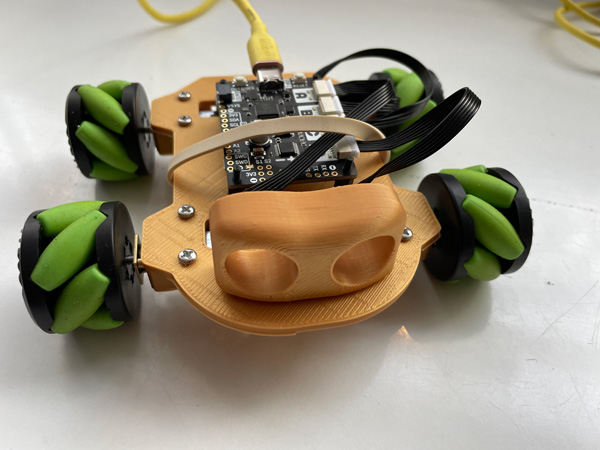

# MecanumRover Class


## Overview
The `MecanumRover` class provides an easy-to-use interface for controlling a mecanum wheel rover. The class simplifies movement and dance sequences by abstracting motor operations into reusable methods. It is designed for embedded systems, such as microcontrollers, with limited resources. This class is inspired by the rover design and control concepts detailed at Kev's Robots. The 3D printable files for the rover are also available on this website.

## Features
- Move forward, backward, strafe, spin, and diagonal directions.
- Easy configuration of speed scaling and directions.
- Predefined dance sequence.
- Efficient management of hardware resources.

---

## Installation
1. Clone the repository:
   ```bash
   git clone <repository_url>
   ```
2. Ensure you have the required hardware and libraries installed:
   - **Motor module**: `motor`, `motor2040`
   - **Pimoroni library**: `REVERSED_DIR`

3. Upload the script to your microcontroller.

---

## Usage
### Importing and Initializing the Class
```python
from mecanum_rover import MecanumRover

# Initialize the rover
rover = MecanumRover(speed_scale=10.0)
```

### Controlling the Rover
- **Move Forward**:
  ```python
  rover.move_forward(speed=3.0, duration=2)
  ```
- **Move Backward**:
  ```python
  rover.move_backward(speed=3.0, duration=2)
  ```
- **Strafe Left**:
  ```python
  rover.strafe_left(speed=3.0, duration=2)
  ```
- **Strafe Right**:
  ```python
  rover.strafe_right(speed=3.0, duration=2)
  ```
- **Spin Clockwise**:
  ```python
  rover.spin_clockwise(speed=3.0, duration=2)
  ```
- **Spin Counterclockwise**:
  ```python
  rover.spin_counterclockwise(speed=3.0, duration=2)
  ```
- **Diagonal Left Forward**:
  ```python
  rover.diagonal_left_forward(speed=3.0, duration=2)
  ```
- **Diagonal Right Forward**:
  ```python
  rover.diagonal_right_forward(speed=3.0, duration=2)
  ```

### Running a Dance Sequence
```python
rover.dance_sequence(speed=3.0, duration=3)
```

### Stopping and Disabling Motors
- **Stop All Motors**:
  ```python
  rover.stop_all()
  ```
- **Disable All Motors**:
  ```python
  rover.disable_motors()
  ```

---

## Class Documentation
### `MecanumRover`
#### Constructor
```python
MecanumRover(speed_scale=10.0)
```
- **Parameters**:
  - `speed_scale` (float): Scaling factor for motor speed. Default is `10.0`.

#### Methods
1. **`enable_motors()`**
   - Enables all motors.

2. **`disable_motors()`**
   - Disables all motors.

3. **`stop_all()`**
   - Stops all motors.

4. **`move(speeds, duration)`**
   - Moves the rover based on the given motor speeds.
   - **Parameters**:
     - `speeds` (list): Speed values for motors `[A, B, C, D]`.
     - `duration` (float): Duration in seconds.

5. **Directional Methods**
   - `move_forward(speed, duration)`
   - `move_backward(speed, duration)`
   - `strafe_left(speed, duration)`
   - `strafe_right(speed, duration)`
   - `spin_clockwise(speed, duration)`
   - `spin_counterclockwise(speed, duration)`
   - `diagonal_left_forward(speed, duration)`
   - `diagonal_right_forward(speed, duration)`

6. **`dance_sequence(speed=3.0, duration=3)`**
   - Runs a predefined dance sequence.
   - **Parameters**:
     - `speed` (float): Speed of the movements.
     - `duration` (float): Duration of each movement in seconds.

---

## Example
```python
from mecanum_rover import MecanumRover

# Initialize the rover
rover = MecanumRover(speed_scale=10.0)

# Perform dance sequence
rover.dance_sequence(speed=3.0, duration=3)

# Stop and disable motors
rover.stop_all()
rover.disable_motors()
```

---

## Acknowledgment
This class is inspired by the rover design and control concepts detailed at [Kev's Robots](https://www.kevsrobots.com/blog/Rover-mecanum.html). The 3D printable files for the rover are also available on this website.

---

## Notes
- Ensure that your hardware is properly configured and powered.
- Use `gc.collect()` to free up resources if running on limited-memory devices.

---

## License
This project is licensed under the MIT License. See `LICENSE` for more details.

---

## Contributions
Feel free to submit issues or pull requests to improve this project. We welcome feedback and suggestions!
