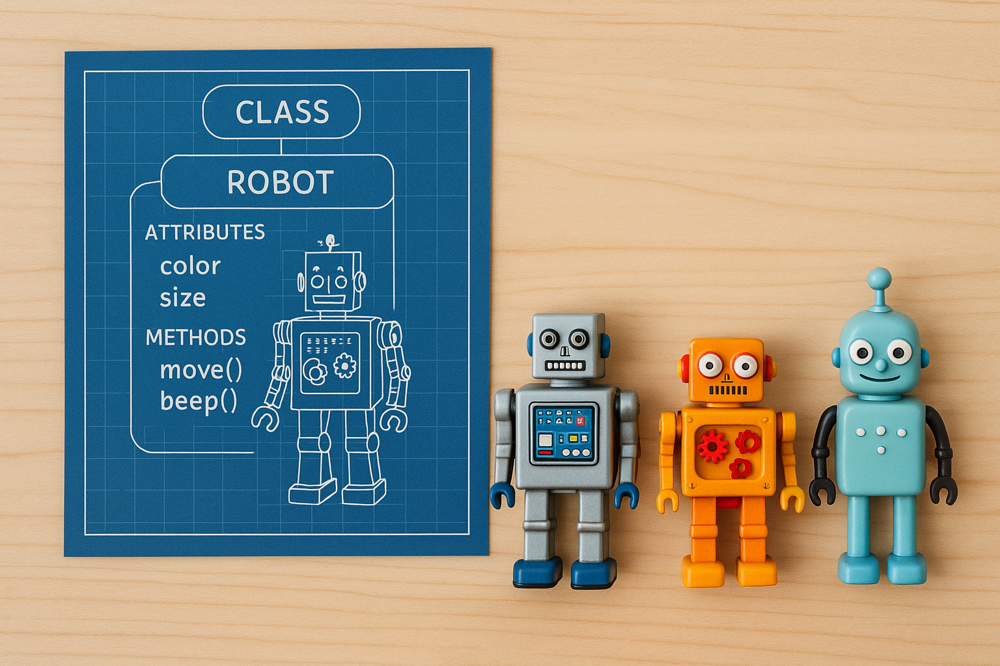
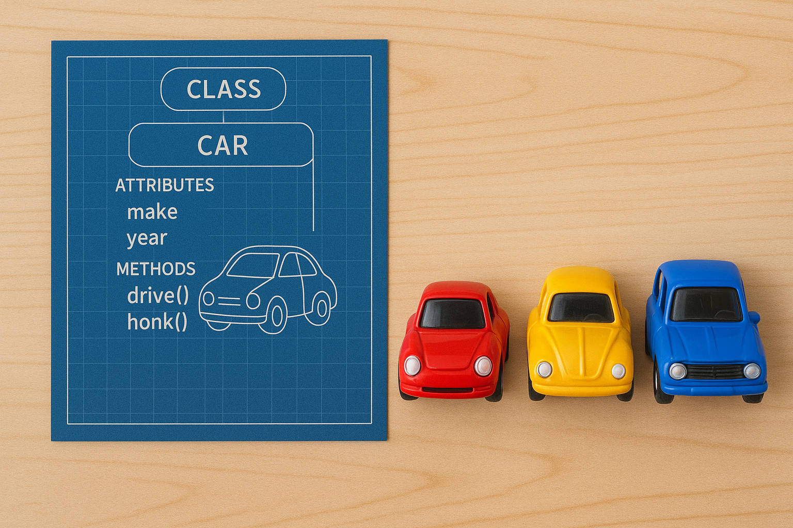

# Programing Paradigms ⠶

## 1)
Copy this program, DO NOT RUN yet:
- Discuss what it will execute
- Run it
- Discuss improvements
- Improve it

```python
from random import randint

for i in range(3):
  a = randint(2, 10)
  b = randint(2, 10)
  c= a *b
  d = input(str(a) + " * " + str(a) + " = ")
  if d == c:
    print("Well done you got it right!")
  else:
    print("Sorry wrong answer")

```


- Variable names should be meaningful, it's a
  progamming **CONVENTION**

---

## 2) Conventions

A convention is…     
An agreed-upon practice, it is the way things are usually done.
Conventions are used in various disciplines to help people work together and collaborate effectively.

Take the following mathematical equation… 

2 + 16 * 20 / 4

How would you work this out?
Which operations (+, * or /) would you calculate first?


You would follow the BIDMAS convention, so you would divide first, then multiply, and then add. 
Why is this convention useful?

- Discuss


### 3) Problems


3a) What is the convention that is broken?
- Fix it
```python
count = 10

time_taken = 0 

numbers = []

import time
from random import randint

for second in range(count):
    numbers.append(randint(0, 100)
    time.sleep(1)
    time_taken += 1

print(numbers)
print(time_taken)
```

3b) What is wrong with this program?
Describe the convention that has been broken here.
```python
timer = 5

if timer > 0:
    timer = timer - 1

if timer > 0:
    timer = timer - 1

if timer > 0:
    timer = timer - 1

if timer > 0:
    timer = timer - 1

if timer > 0:
    timer = timer - 1

if timer == 0:
    print(“Alarm!!”)
```

By following conventions we can create well written programs that a reader can understand. 
Conventions help a reader to interpret a program, helping them locate specific parts more easily.
Conventions gives us guidelines on how to write and structure better programs.

---
## 4) Programming paradigms 
A programming paradigm is a specific way to write programs.

**Programming paradigms** give us a set of guidelines on how to write entire programs!
Paradigm - a typical example or pattern of something; a pattern or model.

What paradigm have we been using already?    

**Procedural**
Code that runs from top to bottom, combining    
- Subroutines: repeated steps bundled together
- Functions: blocks of code that return calculations

```python
timer = input()

while timer > 0:
    timer -= 1
```
Where is the subroutine in this code?
Is it a function or a procedure?


### Problem
Work in pairs. 
- 4a) What does the program do?
- 4b) Why is the program inefficient?
- 4c) Improve it


```python
books = []

print("What is the title of the first book?")
book1 = input()
book1 = book1.capitalize()
index = 0
for book in books:
  if book[0] < book1[0]:
    index = index + 1
books.insert(index, book1)

print("What is the title of the second book?")
book2 = input()
book2 = book2.capitalize()
index = 0
for book in books:
  if book[0] < book2[0]:
    index = index + 1
books.insert(index, book2)

print("What is the title of the third book?")
book3 = input()
book3 = book3.capitalize()
index = 0
for book in books:
  if book[0] < book3[0]:
    index = index + 1
books.insert(index, book3)

print("Your alphabetical collection is...")
print(books)
```

### Questions
- 4d) What is different about the execution of the program?     
- 4e) What is the difference in the way the program is written?     
- 4f) What benefits are there for a reader?     
- 4g) What benefits are there for the writer of the program?
    
4h) How would you change it so the list was sorted in the opposite order?    

## 5) object-oriented programming (OOP).
Object-oriented programming (OOP) is another programming paradigm           
derived from procedural programming. The first language to include.    
object-oriented principles, Simula, was released in 1967. Today, a   
number of modern languages use or allow the use of OOP. 


In procedural programming, data is stored in the main program and passed   
to subroutines. In OOP the data and subroutines are stored together in      
objects which are created from classes.
### New terms
- Objects
- Classes

The OOP paradigm is focused on objects which represent parts of a    
computer program. You can create objects to represent real physical things,    
like a human being. They can also be used for small parts of a larger program,    
like a widget in a user-interface.

To create objects you must first define a class. Here we have a robot class.   
A class is like a blueprint, it contains the plans for the data and    
behaviours an object should possess. You can create many objects from    
a single class. Just like you can make many robots from the same blueprint. 



```
                    +--------------------+
                    |      CLASS         |
                    |      Robot         |
                    +--------------------+
                    | Attributes:        |
                    | - color            |
                    | - size             |
                    | - battery_level    |
                    |                    |
                    | Methods:           |
                    | - move()           |
                    | - beep()           |
                    | - recharge()       |
                    +--------------------+
                            / | \
                           /  |  \
                          /   |   \
                         /    |    \
                        /     |     \
                       /      |      \
        +----------------+ +----------------+ +----------------+
        |  Object: R1    | |  Object: R2    | |  Object: R3    |
        +----------------+ +----------------+ +----------------+
        | color: silver  | | color: orange  | | color: teal    |
        | size: small    | | size: medium   | | size: large    |
        | battery: 70%   | | battery: 40%   | | battery: 90%   |
        | move(), beep() | | move(), beep() | | move(), beep() |
        +----------------+ +----------------+ +----------------+

```

Take a look at this program:
```python
# main.py

from car import Car

my_car = Car("Toyota", "Yaris", 2022)
pm_car = Car("Tesla", "Cyber Truck", 2025)

my_car.honk()
pm_car.honk()

```
....... it contains both a class and object.     
- 5a) What do you think the class is called?     
- 5b) What do you think the objects are called?     




