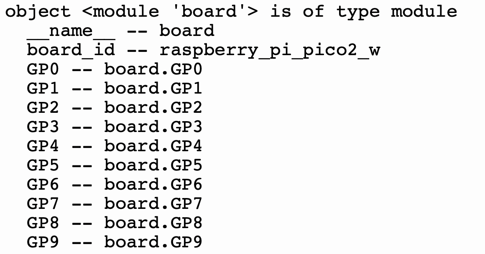
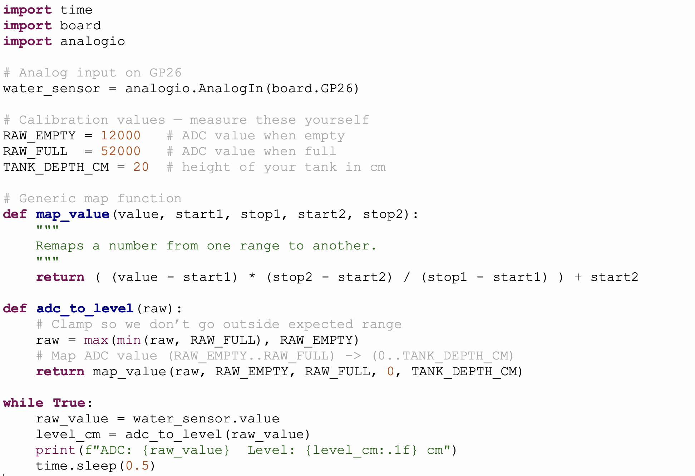

# 🌊 River Level Sensor Network — 3 Hour Workshop

  
[Source: Echo / BBC](https://www.bbc.co.uk/news/articles/cew2vxjgy7lo)

Flooding and river monitoring are serious problems. In the UK there are **90,000 km of rivers** — and measuring their levels can save lives. Today, you’ll learn how to measure water levels with sensors and build your own **IoT river network**.

Previously you used a rpi to serve a website that published river levels. The rpi does not have analog pins so we used a microbit to send the converted analog signal to the pi over serial communication. You used the flask framework to build a working website in html. You did all of this remotely over SSH.

What are the limitations of this setup?
- Scaleability
- Cost
- Setup

In this workshop we are going to look at The Internet of Things paradigm and how we can use it to improve our sensing setup

## Aims
- To scale up your rpi water level project
- To make a robust communication network
- To visualise the data online in a meaningful way

## Concepts
- IOT
- MQTT with Adafruit io
- SSH
- Command Line
- Inputs and Outputs
- Flask

## Tech
- Raspberry pi
- Pi pico
- Water level sensor
- Servo

## Links
 - [Mosquitto](https://mosquitto.org/)
 - [Web server](https://projects.raspberrypi.org/en/projects/python-web-server-with-flask)
 - [Pi Pico](https://www.raspberrypi.com/documentation/microcontrollers/pico-series.html)
 - [Adafruit io prof Gallerger ](https://www.youtube.com/watch?v=H0IetHFuz98)
 - [Pico review](https://www.youtube.com/watch?v=cK9TnktZESM)
 - [Adafruit io Dashboard](https://io.adafruit.com/cuvner/dashboards/water-level-data)

---

## 🕒 Workshop Plan

| Time | Activity | Device |
|------|----------|--------|
| 0:00–0:20 | Setup, intro, RPi vs Pico | Raspberry Pi & Pico |
| 0:20–0:40 | Blink LED test | Pico |
| 0:40–1:10 | Read water sensor | Pico |
| 1:10–1:30 | Map values to cm | Pico |
| 1:30–1:50 | Connect to Wi-Fi & get time | Pico |
| 1:50–2:20 | MQTT: control Pico LED | Pico + Adafruit IO |
| 2:20–2:50 | Publish water levels to cloud | Pico + Adafruit IO |
| 2:50–3:00 | Wrap up + reflection | Both |

---

## 🔎 Raspberry Pi vs Pico

### Raspberry Pi (microprocessor)
- Like a **mini PC**.  
- Runs Linux, has HDMI, USB, internet.  
- Can run Python, web servers, even Minecraft!  
- Great for **complex projects** but uses more power and costs ~£40+.

### Pico (microcontroller)
- Tiny board (~£8).  
- Runs **one program at a time**.  
- Has **analog pins** for sensors.  
- Built-in **Wi-Fi (Pico W/W2)**.  
- Perfect for **simple, low-power sensing tasks**.

👉 **Key fact:**  
If you had to put sensors in hundreds of rivers, which would be cheaper and easier — £40 Raspberry Pis or £8 Picos?  

---

## 1️⃣ Microcontroller Blink Test (Hello World) 

Every Pico has a tiny LED onboard. Blinking it proves your code runs.

First things first we must test our pico is working.
- Connect the USB cable
- Open thonny
- Select the pico port (click bottom right)
- Press the **STOP** button to connect

Traditionally, we print 'Hello World' to the console; however, the microcontroller equivalent is to blink an LED as well.

Every board has an onboard led and that is a simple built in periphiral to access.


- Do you understand the code?  
- Why do we import board and digitalio?    
- What is a pin direction, and why is it set to output? 
- What is the variable, **led**, pointing to?

We can use a help method to get info about any python object:

help() – Built-in method to provide helpful information

**Run this code using thonny**

```python
import board
help(board)
```



We can see the name of the GPIO on the left and the object dot notation on the right.

Run your code and then answer these questions:
- What is the object that stores the pin info?
- What pins are analog?
- Can you find the pin address for the onboard led?


**Run this code using thonny**

```python
import time, board, digitalio
led = digitalio.DigitalInOut(board.LED)
led.direction = digitalio.Direction.OUTPUT

while True:
    led.value = True
    time.sleep(0.5)
    led.value = False
    time.sleep(0.5)
```

💡 Did you know? “Hello World” was first used as a test program in 1972 by Brian Kernighan. On microcontrollers, blinking an LED is the new Hello World.


**CONGRATULATIONS** you have successfully tested your pico

---

## 2️⃣ Analog Sensor: Measuring Water


Water level sensors measure how much water touches their tracks:
- **No water** → low voltage  
- **Full water** → higher voltage  

The Pico converts voltage into a number (0–65535). This is called **ADC** (Analog-to-Digital Conversion).  


What connections do we need?
Is the analog pin in the illustration correct?

Look at this code, what is going on?
- Once you can read it correctly run it.
- Fix any errors

```python
import time, board, analogio
water_sensor = analogio.AnalogIn(board.GP26)

while True:
    print(water_sensor.value)  # Raw value 0–65535
    time.sleep(0.5)
```

👉 Fact: Older Arduino boards only used 10 bits (0–1023). The Pico uses 16 bits (0–65535), which means it can measure with much finer detail.

---

## 3️⃣ Mapping: Turning Numbers into Meaning

Raw numbers are confusing. A value like `34567` doesn’t tell you much. But if we **map** it to centimeters, suddenly it makes sense:  
> 0 water = 0 cm  
> Full tank = 20 cm

Look at this code:
- Predict what will happen
- Why are captals used?



An analogue value is non-sensical to most people. We need to provide some context for this.
We use a process called **mapping** where by we map one value to another, for example:
Take the number 10456. This is how many cornflakes make up one 750g packet.
What mathematical operation can I perform to map 1 cornflake to grams?

# 🗺️ Mapping Numbers with `map()`

When computers read from sensors or give us raw numbers, those numbers don’t always make sense.  
We use **mapping** to convert numbers from one scale to another.

---

## The `map()` Function

We’ll copy the style from **Arduino/Processing** because it’s clear and easy to read.

```python
def map_value(value, start1, stop1, start2, stop2):
    """
    Remaps a number from one range to another.

    value  - the number to be mapped
    start1 - lower bound of the value's current range
    stop1  - upper bound of the value's current range
    start2 - lower bound of the value's target range
    stop2  - upper bound of the value's target range
    """
    return ( (value - start1) * (stop2 - start2) / (stop1 - start1) ) + start2
```

---

## Step-by-Step Explanation

Think of **two rulers**:  

- **Ruler A** = input numbers (like cornflakes count).  
- **Ruler B** = output numbers (like grams).  

We find out *where we are* on the first ruler, and then mark the **same spot** on the second ruler.  

---

## 🎯 Visual Example

We know:  
- **0 flakes = 0 g**  
- **10,456 flakes = 750 g**  

So what about **2000 flakes**?

### Input ruler (flakes)

```
[0 flakes]----|--------------------------[10,456 flakes]
              ^
               2000 flakes (where we are)
```

### Output ruler (grams)

```
[0 g]---------|--------------------------[750 g]
              ^
              143 g (mapped result)
```

We’re about **20%** along the first ruler, so we’re also about **20%** along the second ruler.

---

## 📝 Python Cornflakes Example

```python
CORNFLAKES_IN_PACKET = 10456
PACKET_WEIGHT_GRAMS = 750

#Add the map function

num_flakes = int(input("How many cornflakes do you have? "))

weight = map_value(num_flakes, 0, CORNFLAKES_IN_PACKET, 0, PACKET_WEIGHT_GRAMS)

print(f"{num_flakes} cornflakes weigh about {weight:.2f} grams")
```

---

## ▶️ Example Run

```
How many cornflakes do you have? 2000
2000 cornflakes weigh about 143.48 grams
```

---

## Why this is useful

- Works for **any ranges**:  
  - ADC 0–65535 → water height 0–20 cm  
  - Joystick 0–1023 → screen 0–799  
  - Slider 0–100 → volume 0.0–1.0  

👉 Mapping is just a **translator**: it takes numbers from one world and finds their meaning in another.  

Let's now use a map in a program that reads the analogue input.


```python
import time
import board
import analogio

# Analog input on GP26
water_sensor = analogio.AnalogIn(board.GP26)

# Calibration values — measure these yourself
RAW_EMPTY = 12000   # ADC value when empty
RAW_FULL  = 52000   # ADC value when full
TANK_DEPTH_CM = 20  # height of your tank in cm

# Generic map function
def map_value(value, start1, stop1, start2, stop2):
    """
    Remaps a number from one range to another.
    """
    return ( (value - start1) * (stop2 - start2) / (stop1 - start1) ) + start2

def adc_to_level(raw):
    # Clamp so we don’t go outside expected range
    raw = max(min(raw, RAW_FULL), RAW_EMPTY)
    # Map ADC value (RAW_EMPTY..RAW_FULL) -> (0..TANK_DEPTH_CM)
    return map_value(raw, RAW_EMPTY, RAW_FULL, 0, TANK_DEPTH_CM)

while True:
    raw_value = water_sensor.value
    level_cm = adc_to_level(raw_value)
    print(f"ADC: {raw_value}  Level: {level_cm:.1f} cm")
    time.sleep(0.5)

```

💡 Analogy: Mapping is like using two rulers. If you’re 50% along ruler A, you’re also 50% along ruler B.

---

## 4️⃣ Pico + Wi-Fi Test


The Pico W can connect to the internet! Let’s grab the real time:

```python
import wifi, socketpool, ssl, adafruit_requests

wifi.radio.connect("YOUR_WIFI", "YOUR_PASS")
print("IP:", wifi.radio.ipv4_address)

pool = socketpool.SocketPool(wifi.radio)
https = adafruit_requests.Session(pool, ssl.create_default_context())

r = https.get("http://worldtimeapi.org/api/ip")
print("Time:", r.json()["datetime"])
```

👉 Protocol used here = **HTTP (web)**.

---

## 5️⃣ IoT & MQTT

  
[Source: Tekon](https://www.tekonelectronics.com/en/news/tekon-blog/understanding-mqtt-protocol/)

IoT = Internet of Things → devices talk over the internet.  

If a microcontroller has Wi-Fi capabilities, it means that it can send messages containing data.  
Therefore, we must choose **how** we send our messages.  

There are many **messaging protocols** (rules for talking) depending on what we want to achieve:

- 📡 **HTTP** – the same system web browsers use.  
  Good for webpages, but heavier and slower for tiny devices.  

- 🔔 **WebSockets** – a live two-way chat between computers.  
  Faster, but still more complex to set up.  

- ✉️ **MQTT** – lightweight, simple, and designed for devices like the Raspberry Pi Pico.  
  Perfect when you have lots of small devices sending quick updates (like river levels).  

We choose **MQTT** because:  
- It uses **very little power and data**.  
- Devices don’t have to know about each other — they only talk to the **broker**.  
- It’s easy to **scale up**: two Picos or two thousand, same system.  

That’s why MQTT is one of the most popular protocols for the **Internet of Things (IoT)**.  

---


[mqtt image](https://www.tekonelectronics.com/en/news/tekon-blog/understanding-mqtt-protocol/)

## The concept unpacked

Imagine:
- Lots of kids in a classroom (the **Picos**).  
- They all want to share info like “my sandwich is 80% eaten.”  
- Instead of shouting across the room, they pass notes to the **teacher** (the **broker**).  
- The teacher gives those notes only to kids who said, “I’m interested in sandwich updates” (the **subscribers**).  

Result:  
- Everyone shares safely.  
- You only get info you actually want.  
- The teacher keeps things organised.  

---

## 🛠 In reality

- Each **Pico W** has Wi-Fi.  
- It can connect to the internet and send/receive messages.  
- The system they use is called **MQTT** (Message Queuing Telemetry Transport).  

MQTT has 3 parts:  
1. **Publisher** → sends a message (Pico sending `river1 = 12cm`).  
2. **Subscriber** → listens for that message (a dashboard, or another Pico).  
3. **Broker** → middleman server (like Adafruit IO) that delivers the message to the right place.  

---

## ✅ Why are we using MQTT?  

Think of other ways devices could talk:  
- 📣 **Broadcast/shouting** → everyone hears everything (wasteful, confusing).  
- 📬 **Direct messages** → you’d need every Pico to know where every other Pico lives (complicated).  

Instead, MQTT is like a **post office for messages**:  
- 🔌 **Lightweight** → it uses very little power and data, perfect for tiny devices like Picos.  
- 📮 **Organised** → messages go through a broker, so Picos don’t need to know about each other.  
- 🎯 **Selective** → you only get the messages (topics) you subscribe to, so no overload.  
- 🌍 **Scalable** → works for 2 Picos or 2,000, no big change in setup.  

That’s why MQTT is used in the **Internet of Things (IoT)** — smart homes, sensors, wearables, and now your **UK river monitoring network**.  

---

## 🎯 Example Flow

- Pico A publishes → `water/river1 = 12cm`  
- Broker (Adafruit IO) holds it.  
- Your dashboard subscribes → sees “12cm” instantly.  
- RPI, pico, computer could also subscribe if it cares about river1.  

---

## 🧩 summary

- MQTT = **post office for tiny computers**.  
- Each Pico = a pen pal.  
- The broker = the post office.  
- Messages = letters.  
- Subscribe = signing up for the letters you actually want.  

That’s why your Picos can all be part of a **smart, efficient, and tidy network** 🌊.  


---

## 6️⃣ Toggle Pico LED from the Cloud

Let's take our blinking LED example and apply some IOT to it.
Open up a new program.

First import all your libraries. Notice all the libraries required for wifi and MQTT.

```python
import time, ssl, wifi, socketpool, board, digitalio
import adafruit_minimqtt.adafruit_minimqtt as MQTT
from adafruit_io.adafruit_io import IO_MQTT
```

Next we need to put our wifi and adafruit io config into variables.
Create your own Adafruit io account [click here](https://io.adafruit.com/).


Once you have an account you will need:
- copy Username to program
- copy Key to program
- create feed "toggle-led"


Then:
Add this code next

```python

# ---------- CONFIG ----------
AIO_USERNAME = "YOUR_USERNAME"
AIO_KEY      = "YOUR_AIO_KEY"

WIFI_SSID    = "YOUR_WIFI"
WIFI_PASS    = "YOUR_WIFI_PASSWORD"

FEED_TOGGLE  = "toggle-led"    # feed your Adafruit IO Toggle writes to
# ---------------------------

led = digitalio.DigitalInOut(board.LED)
led.switch_to_output(value=False)

```

Now we connect to a router.

```python
# Wi-Fi
print("Connecting to Wi-Fi...")
wifi.radio.connect(WIFI_SSID, WIFI_PASS)
print("Connected:", wifi.radio.ipv4_address)
```

Run your code to check for errors.   

Now we setup our connection to the internet and MQTT.    
Here Ive broken down the MQTT setup into familiar context:
Imagine:

- Wi-Fi radio = the road.
- Socket = the driveway that lets you connect to the road.
- MQTT = the postal service that knows how to handle letters.
- Broker (Adafruit IO) = the central post office.
- Username/Password = your ID card so the post office trusts you.
- SSL = sealing your letters in a locked envelope so nobody can snoop.
- Port 8883 = the specific mailbox slot for “secure MQTT letters”.

At the end, your Pico has a post office box set up — ready to send and receive messages with other devices safely.

```python
# Socket + MQTT (TLS/SSL on 8883)
pool = socketpool.SocketPool(wifi.radio)
mqtt = MQTT.MQTT(
    broker="io.adafruit.com",
    username=AIO_USERNAME,
    password=AIO_KEY,
    socket_pool=pool,
    ssl_context=ssl.create_default_context()
)
io = IO_MQTT(mqtt)
```

Our picos are now ready to connect to the broker. First, we need to define some functions to handle the messages we will receive.

```python

# ---- callbacks ----

def handle_connect(client):
    print("Connected to Adafruit IO")
    print("Subscribing to:", FEED_TOGGLE)
    io.subscribe(FEED_TOGGLE)   # subscribe by feed key

def handle_message(client, topic, payload):
    text = str(payload).strip().lower()
    print(f"[MSG] {topic} -> '{text}'")
    # Topic from IO_MQTT is the feed key ('toggle-led'); no full topic check needed
    led.value = text in ("on", "1", "true", "high")
    print("LED =>", "ON" if led.value else "OFF")

io.on_connect = handle_connect
io.on_message = handle_message

io.connect()

```

The laast thing we need to do is create a loop that keeps our MQTT alive.

```python
# Simple publisher loop + MQTT processing
last_pub = 0
while True:
    io.loop()  # IMPORTANT: processes incoming MQTT messages

    #Setup for publishing
    now = time.monotonic()
    if now - last_pub >= PUBLISH_EVERY_SECONDS:
        last_pub = now
        #water_level = 123  # TODO: replace with your real sensor read
        #print("Publishing water level:", water_level)
        #io.publish(FEED_PUBLISH, water_level)

    time.sleep(0.05)

```


### Full program
```python
import time, ssl, wifi, socketpool, board, digitalio
import adafruit_minimqtt.adafruit_minimqtt as MQTT
from adafruit_io.adafruit_io import IO_MQTT


# ---------- CONFIG ----------
AIO_USERNAME = "cuvner"
AIO_KEY      = "add your own"

WIFI_SSID    = "J&C"
WIFI_PASS    = "Flat4141"

FEED_TOGGLE  = "toggle-led"    # feed your Adafruit IO Toggle writes to
PUBLISH_EVERY_SECONDS = 10     # Timer to control publishing messages
# ---------------------------

led = digitalio.DigitalInOut(board.LED)
led.switch_to_output(value=False)

# Wi-Fi
print("Connecting to Wi-Fi...")
wifi.radio.connect(WIFI_SSID, WIFI_PASS)
print("Connected:", wifi.radio.ipv4_address)

# Socket + MQTT (TLS/SSL on 8883)
pool = socketpool.SocketPool(wifi.radio)
mqtt = MQTT.MQTT(
    broker="io.adafruit.com",
    username=AIO_USERNAME,
    password=AIO_KEY,
    socket_pool=pool,
    ssl_context=ssl.create_default_context()
)
io = IO_MQTT(mqtt)


# ---- callbacks ----

def handle_connect(client):
    print("Connected to Adafruit IO")
    print("Subscribing to:", FEED_TOGGLE)
    io.subscribe(FEED_TOGGLE)   # subscribe by feed key

def handle_message(client, topic, payload):
    text = str(payload).strip().lower()
    print(f"[MSG] {topic} -> '{text}'")
    # Topic from IO_MQTT is the feed key ('toggle-led'); no full topic check needed
    led.value = text in ("on", "1", "true", "high")
    print("LED =>", "ON" if led.value else "OFF")

io.on_connect = handle_connect
io.on_message = handle_message

io.connect()

# Simple publisher loop + MQTT processing
last_pub = 0
while True:
    io.loop()  # IMPORTANT: processes incoming MQTT messages

    #Setup for publishing
    now = time.monotonic()
    if now - last_pub >= PUBLISH_EVERY_SECONDS:
        last_pub = now
        #water_level = 123  # TODO: replace with your real sensor read
        #print("Publishing water level:", water_level)
        #io.publish(FEED_PUBLISH, water_level)

    time.sleep(0.05)

```
**SAVE YOUR WORK**

✅ Toggle switch → LED changes instantly!

---

## 7️⃣ Publish River Levels to Cloud

You now need to combine the analogue sensor program:
- Create a new mqtt program
- Carefully copy lines across into a new mqtt program
- HAVE A GO

```python
import time
import board
import analogio

# Analog input on GP26
water_sensor = analogio.AnalogIn(board.GP26)

# Calibration values — measure these yourself
RAW_EMPTY = 12000   # ADC value when empty
RAW_FULL  = 52000   # ADC value when full
TANK_DEPTH_CM = 20  # height of your tank in cm

# Generic map function
def map_value(value, start1, stop1, start2, stop2):
    """
    Remaps a number from one range to another.
    """
    return ( (value - start1) * (stop2 - start2) / (stop1 - start1) ) + start2

def adc_to_level(raw):
    # Clamp so we don’t go outside expected range
    raw = max(min(raw, RAW_FULL), RAW_EMPTY)
    # Map ADC value (RAW_EMPTY..RAW_FULL) -> (0..TANK_DEPTH_CM)
    return map_value(raw, RAW_EMPTY, RAW_FULL, 0, TANK_DEPTH_CM)

while True:
    raw_value = water_sensor.value
    level_cm = adc_to_level(raw_value)
    print(f"ADC: {raw_value}  Level: {level_cm:.1f} cm")
    time.sleep(0.5)

```
👉 Check Adafruit IO → live graph of water levels 🌊.

---
## 8️⃣ Raspberry pi webserver

Lets use our pi's to subscribe to our river-level feed and visualise it on a website
- Start up your pi
- open terminal and update ``` sudo apt update ```
- Get your ip address ``` hostname -I ```
- Back on your pc open PUTTY and ssh in to your pi
- Create a folder mqtt_water_level ``` mkdir mqtt_water_level ```
- cd into folder ``` cd mqtt_water_level```
- create a virtual environment for our webapp

```python
# Install venv if not installed
sudo apt install python3-venv -y

# Create a virtual environment
python3 -m venv myenv

# Activate it
source myenv/bin/activate

# Now install your packages inside
pip install flask adafruit-io paho-mqtt
```
- Create a templates folder  ``` mkdir templates ```
- cd into folder
- make a index.html file ``` nano index.html ```
- paste code and save

index.html
 ```html
<!DOCTYPE html>
<html>
<head>
  <title>River Level Monitor</title>
  <script src="https://cdn.jsdelivr.net/npm/chart.js"></script>
</head>
<body>
  <h1>🌊 River Height Monitor</h1>
  <p>Latest Level: <span id="level">--</span> cm</p>
  <canvas id="chart" width="400" height="200"></canvas>

  <script>
    const ctx = document.getElementById('chart').getContext('2d');
    const chart = new Chart(ctx, {
      type: 'line',
      data: {
        labels: [],
        datasets: [{
          label: 'River Height (cm)',
          data: [],
          borderColor: 'blue',
          fill: false
        }]
      }
    });

    async function fetchData() {
      const res = await fetch('/data');
      const json = await res.json();
      if (json.level !== null) {
        document.getElementById('level').textContent = json.level.toFixed(2);
        chart.data.labels.push(new Date().toLocaleTimeString());
        chart.data.datasets[0].data.push(json.level);
        chart.update();
      }
    }

    setInterval(fetchData, 2000);
  </script>
</body>
</html>

```
- Go back into main folder `` cd .. ``
- create a python app.py program ``` nano app.py ```
- paste in the webapp code
- add your adafruit io username and key

app.py
```python
import threading
from flask import Flask, render_template, jsonify
import paho.mqtt.client as mqtt

# ---- CONFIG ----
AIO_USERNAME = "YOUR_USERNAME"
AIO_KEY      = "YOUR_AIO_KEY"
FEED         = "water-level"
BROKER       = "io.adafruit.com"
PORT         = 1883   # unsecured MQTT (8883 if you want TLS)
# ----------------

# Global storage of latest values
latest_value = {"level": None}

# Flask app
app = Flask(__name__)

@app.route("/")
def index():
    return render_template("index.html")

@app.route("/data")
def data():
    return jsonify(latest_value)

# ---- MQTT Callbacks ----
def on_connect(client, userdata, flags, rc):
    print("Connected to Adafruit IO:", rc)
    topic = f"{AIO_USERNAME}/feeds/{FEED}"
    client.subscribe(topic)
    print("Subscribed to", topic)

def on_message(client, userdata, msg):
    global latest_value
    payload = msg.payload.decode()
    print(f"MQTT: {msg.topic} -> {payload}")
    latest_value["level"] = float(payload)

# Setup MQTT client
mqtt_client = mqtt.Client()
mqtt_client.username_pw_set(AIO_USERNAME, AIO_KEY)
mqtt_client.on_connect = on_connect
mqtt_client.on_message = on_message

# Background thread for MQTT loop
def mqtt_thread():
    mqtt_client.connect(BROKER, PORT, 60)
    mqtt_client.loop_forever()

threading.Thread(target=mqtt_thread, daemon=True).start()

# Run Flask
if __name__ == "__main__":
    app.run(host="0.0.0.0", port=5000, debug=True)


```
- save code
- run app.py ``` python app.py ```
---


---

## 9️⃣ Reflection & Next Steps

- **Fact:** MQTT is used in smart homes, car sensors, even satellites.  
- **Question:** If you had 100 Picos in rivers, how would you keep track?  
- **Extension:** Use Flask on a Raspberry Pi to make your own live web dashboard.  

---

# ✅ Summary

- Raspberry Pi = full computer, Pico = tiny controller.  
- Sensors give analog values → we **map** them to useful units.  
- Pico connects via **Wi-Fi**.  
- Devices use **MQTT** to send/receive messages.  
- You built an **IoT sensor network** for rivers!  
