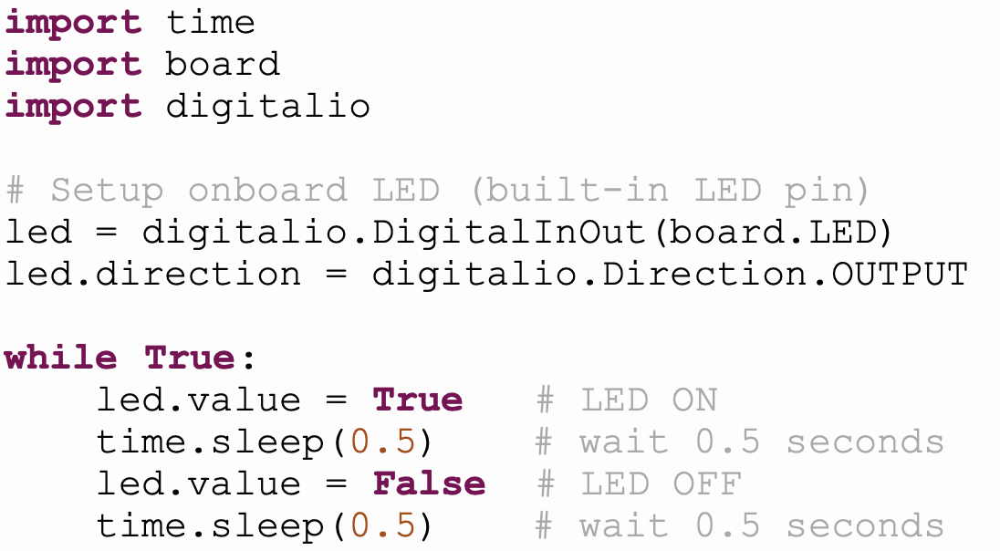
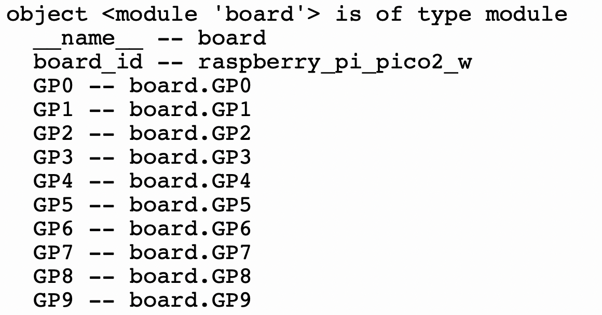
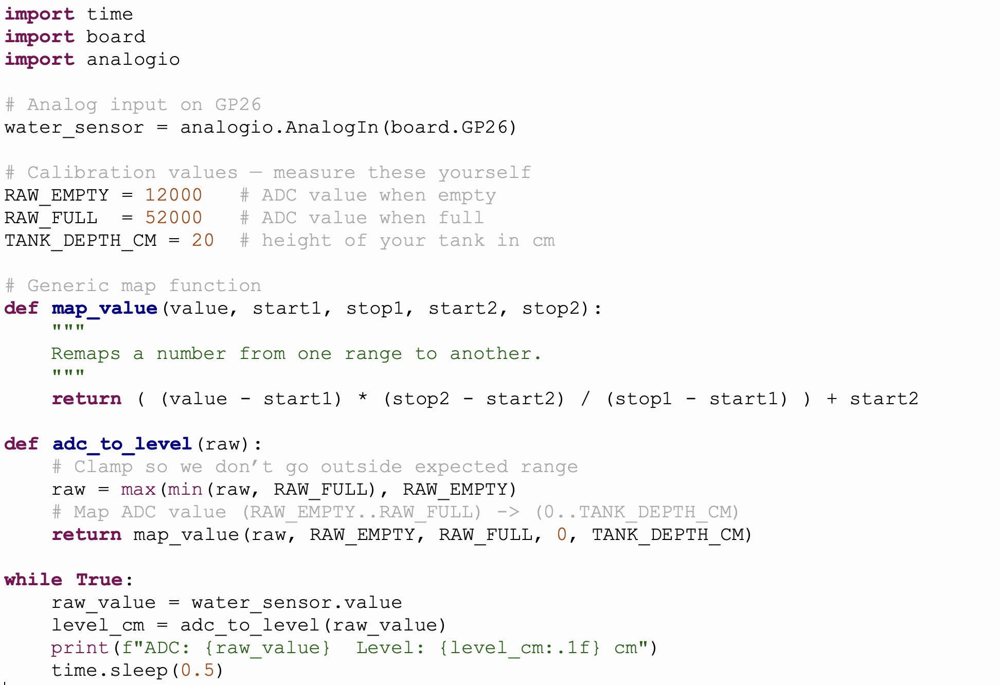

# River level sensor network
Previously you used a rpi to serve a website that published river levels. The rpi does not have analog pins so we used a microbit to send the converted analog signal to the pi over serial communication. You used the flask framework to build a working website in html. You did all of this remotely over SSH.

What are the limitations of this setup?
- Scaleability
- Cost
- Setup

In this workshop we are going to look at The Internet of Things paradigm and how we can use it to improve our sensing setup

## Aims
- To scale up your rpi water level project
- To make a robust communication network
- To visualise the data in a meaningful way


## Objectives
- Young coders can demonstrate competence using the commnad line
- Young coders can explain IOT
- Young coders can list network protocols
- Young coders can explain ssh and demonstate using it
- Young coders can differetiate between micro controller and micro processors
- Young coders can know where to find documentation
- Young coders can apply what they have learnt and list future iot projects
- Young coders can explain analog and digital sensors
- Young coders can find pin diagrams and locate io pins for the appropriate sensor

## Concepts
- IOT
- MQTT with mosquito
- SSH
- Command Line
- Inputs and Outputs
- Flask

## Tech
- Raspberry pi
- Pi pico
- Water level sensor
- Servo

## Links
 - [Mosquitto](https://mosquitto.org/)
 - [Web server](https://projects.raspberrypi.org/en/projects/python-web-server-with-flask)
 - [Pi Pico](https://www.raspberrypi.com/documentation/microcontrollers/pico-series.html)
 - [Adafruit io prof Gallerger ](https://www.youtube.com/watch?v=H0IetHFuz98)
 - [Pico review](https://www.youtube.com/watch?v=cK9TnktZESM)
 - [Adafruit io Dashboard](https://io.adafruit.com/cuvner/dashboards/water-level-data)


## Steps
- 1.) Setup pi, update, upgrade, connect to wifi
- 2.) Setup pi pico and run hello world(blink_led)
  - a. blink led
  - b. Find/use analog pin and wire up the water level
  - c. Read analog value
  - d. Setup wifi and test get some data and print it
  - e. Setup mosquitto or adafruit io and test subscribe and publish
 
## 1.) PI

Connect pi to HDMI, power, mouse and key board.

Check wifi connection

Lets update and upgrade the os 

Check your ip address ``` hostname -I ```

Return back to PC, run putty and connect over ssh to your pi using your ip address

Try to find the pi with your folder on it and swap with each other


## 2.) Pi pico

In your last project, you used the Raspberry Pi and a Micro:bit to measure water level. This was perfect to prove a concept.
Did you know there are 90,000 km of rivers in UK ([freshwaterhabitats.org.uk](https://freshwaterhabitats.org.uk/habitats/rivers/)).
Would it be efficient to place RPI's, consider how powerful a pi is, the cost and the size of it.
Now we want to roll this out across the UK

The pi pico is a powerful microcontroller, it might be small but it has a lot of potential.

``` text
  Form factor: 21 mm × 51 mm
  CPU: Dual Arm Cortex-M33 or dual RISC-V Hazard3 processors @150MHz
  Memory: 520 KB on-chip SRAM; 4 MB on-board QSPI flash
  Connectivity: 2.4GHz 802.11n wireless LAN and Bluetooth 5.2
  Interfacing: 26 multi-purpose GPIO pins, including 4 that can be used for ADC
  Peripherals:
      2 × UART
      2 × SPI controllers
      2 × I2C controllers
      24 × PWM channels
      1 × USB 1.1 controller and PHY, with host and device support
      12 × PIO state machines
```

What are GPIO pins for?
Can we connect an analog sensor?
Does the pico have wifi capabilities and how do you know if your board does?
Compare and list the differences between a pico and a rpi-4/5?

### a.) 
First things first we must test our pico is working.
- Connect the USB cable
- Open thonny
- Select the pico port (click bottom right)
- Press the **STOP** button to connect

Traditionally, we print 'Hello World' to the console; however, the microcontroller equivalent is to blink an LED as well.

Every board has an onboard led and that is a simple built in periphiral to access.



- Do you understand the code?  
- Why do we import board and digitalio?    
- What is a pin direction, and why is it set to output? 
- What is the variable, **led**, pointing to?

We can use a help method to get info about any python object:

help() – Built-in method to provide helpful information

**Run this code using thonny**

```python
import board
help(board)
```



We can see the name of the GPIO on the left and the object dot notation on the right.

Run your code and then answer these questions:
- What is the object that stores the pin info?
- What pins are analog?
- Can you find the pin address for the onboard led?


**Run this code using thonny**

```python
import time
import board
import digitalio

# Setup onboard LED (built-in LED pin)
led = digitalio.DigitalInOut(board.LED)
led.direction = digitalio.Direction.OUTPUT

while True:
    led.value = True   # LED ON
    time.sleep(0.5)    # wait 0.5 seconds
    led.value = False  # LED OFF
    time.sleep(0.5)    # wait 0.5 seconds

```


**CONGRATULATIONS** you have successfully tested your pico

### b. Find/use analog pin and wire up the water level


#### 🧪 What It Does
- Water touches the sensor → electricity flows
- More water = more voltage


#### 🔢 Analog Values
Your water sensor gives a number between **0** (dry) and **1023** (very wet).

---

#### 🧪💧 How Does the Water Sensor Work with the Micro:bit?

##### 1️⃣ What the Sensor Does
The **water level sensor** has metal lines. When water touches them, it sends more **electric power** (called **voltage**) to the micro:bit.  
- **No water** = **low voltage**  
- **More water** = **higher voltage**

##### 2️⃣ But Microcontrollers Don't Understand Volts!
Microcontrollers don't measure voltage like we do — they **turn voltage into a number**.  
It does this using a special function called **analog read**.

##### 3️⃣ The Magic Numbers: 0 to 1023

| Voltage (0–3.3V) | Number it gives you |
|------------------|---------------------|
| 0 volts          | 0                   |
| 1.65 volts       | 512                 |
| 3.3 volts        | 1023                |

So if the sensor gives 2 volts, the microcontroller might show a number like **620**.

##### 4️⃣ Why 1023? Why Not Just Use Volts?
Because the microcontrollers are a **computer**, and computers **use binary** — just 1s and 0s.

To measure the voltage, it uses **10 binary digits (bits)** like little light switches:
```
0000000000 → 0  
1111111111 → 1023
```

That gives **1024 tiny steps** to measure small changes in voltage.

#### 🍫 Chocolate Bar Example
Imagine a chocolate bar cut into **1024 tiny pieces**:
- No water? You get 0 pieces.
- Half full? You get 512 pieces.
- Fully full? You get 1023 pieces!

#### ✅ Summary
- Sensor sends **0 to 3.3V**
- Microcontroller turns it into **0 to 1023**
- That number = how wet the sensor is!


### Connect the sensor


What connections do we need?
Is the analog pin in the illustration correct?

Look at this code, what is going on?
- Once you can read it correctly run it.
- Fix any errors

```python
import time
import board
import analogio

# Create analog input on GP26
water_sensor = analogio.AnalogIn(board.GP27_A1)

while True:
    print(water_sensor.value)  # Raw value (0–65535)
    sleep(0.5)

```

**Great** we are now reading an analogue sensor but ask yourselve these questions:
- Does the output mean anything to you or perhaps a member of the public?
- What context would be helpful when measuring water height?

Look at this code:
- Predict what will happen
- Why are captals used?



An analogue value is non-sensical to most people. We need to provide some context for this.
We use a process called **mapping** where by we map one value to another, for example:
Take the number 10456. This is how many cornflakes make up one 750g packet.
What mathematical operation can I perform to map 1 cornflake to grams?

# 🗺️ Mapping Numbers with `map()`

When computers read from sensors or give us raw numbers, those numbers don’t always make sense.  
We use **mapping** to convert numbers from one scale to another.

---

## The `map()` Function

We’ll copy the style from **Arduino/Processing** because it’s clear and easy to read.

```python
def map_value(value, start1, stop1, start2, stop2):
    """
    Remaps a number from one range to another.

    value  - the number to be mapped
    start1 - lower bound of the value's current range
    stop1  - upper bound of the value's current range
    start2 - lower bound of the value's target range
    stop2  - upper bound of the value's target range
    """
    return ( (value - start1) * (stop2 - start2) / (stop1 - start1) ) + start2
```

---

## Step-by-Step Explanation

Think of **two rulers**:  

- **Ruler A** = input numbers (like cornflakes count).  
- **Ruler B** = output numbers (like grams).  

We find out *where we are* on the first ruler, and then mark the **same spot** on the second ruler.  

---

## 🎯 Visual Example

We know:  
- **0 flakes = 0 g**  
- **10,456 flakes = 750 g**  

So what about **2000 flakes**?

### Input ruler (flakes)

```
[0 flakes]----|--------------------------[10,456 flakes]
              ^
               2000 flakes (where we are)
```

### Output ruler (grams)

```
[0 g]---------|--------------------------[750 g]
              ^
              143 g (mapped result)
```

We’re about **20%** along the first ruler, so we’re also about **20%** along the second ruler.

---

## 📝 Python Cornflakes Example

```python
CORNFLAKES_IN_PACKET = 10456
PACKET_WEIGHT_GRAMS = 750

#Add the map function

num_flakes = int(input("How many cornflakes do you have? "))

weight = map_value(num_flakes, 0, CORNFLAKES_IN_PACKET, 0, PACKET_WEIGHT_GRAMS)

print(f"{num_flakes} cornflakes weigh about {weight:.2f} grams")
```

---

## ▶️ Example Run

```
How many cornflakes do you have? 2000
2000 cornflakes weigh about 143.48 grams
```

---

## Why this is useful

- Works for **any ranges**:  
  - ADC 0–65535 → water height 0–20 cm  
  - Joystick 0–1023 → screen 0–799  
  - Slider 0–100 → volume 0.0–1.0  

👉 Mapping is just a **translator**: it takes numbers from one world and finds their meaning in another.  

Let's now use a map in a program that reads the analogue input.

```python
import time
import board
import analogio

# Analog input on GP26
water_sensor = analogio.AnalogIn(board.GP26)

# Calibration values — measure these yourself
RAW_EMPTY = 12000   # ADC value when empty
RAW_FULL  = 52000   # ADC value when full
TANK_DEPTH_CM = 20  # height of your tank in cm

# Generic map function
def map_value(value, start1, stop1, start2, stop2):
    """
    Remaps a number from one range to another.
    """
    return ( (value - start1) * (stop2 - start2) / (stop1 - start1) ) + start2

def adc_to_level(raw):
    # Clamp so we don’t go outside expected range
    raw = max(min(raw, RAW_FULL), RAW_EMPTY)
    # Map ADC value (RAW_EMPTY..RAW_FULL) -> (0..TANK_DEPTH_CM)
    return map_value(raw, RAW_EMPTY, RAW_FULL, 0, TANK_DEPTH_CM)

while True:
    raw_value = water_sensor.value
    level_cm = adc_to_level(raw_value)
    print(f"ADC: {raw_value}  Level: {level_cm:.1f} cm")
    time.sleep(0.5)

```


