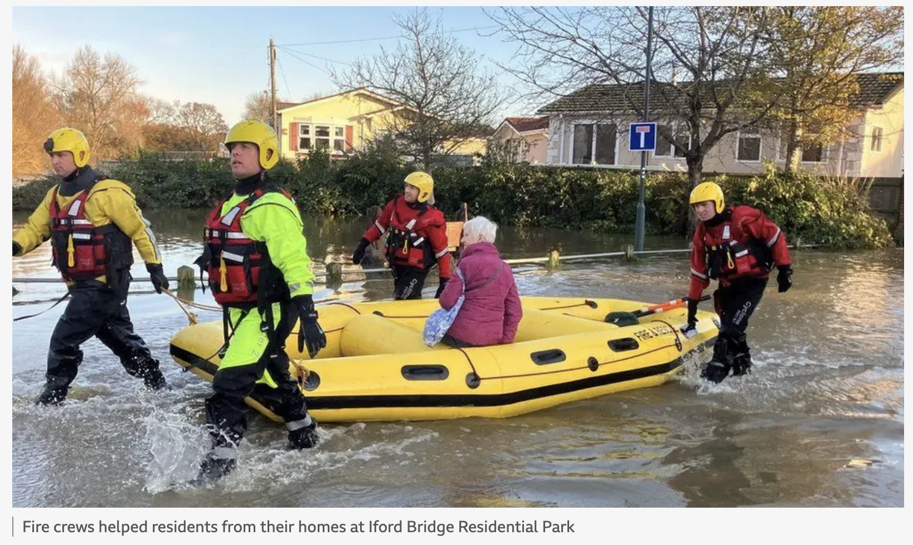
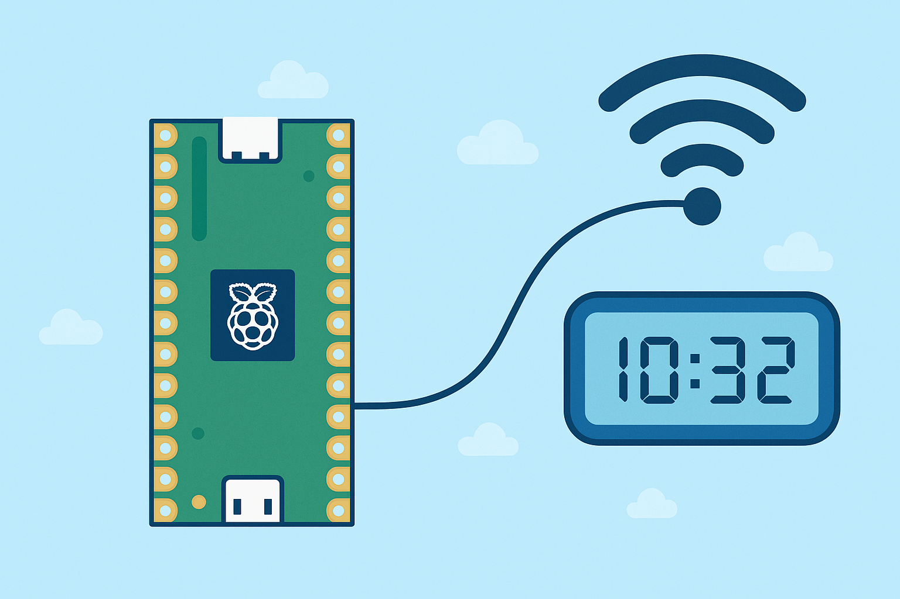

# 🌊 River Level Sensor Network — 3 Hour Workshop

  
[Source: Echo / BBC](https://www.bbc.co.uk/news/articles/cew2vxjgy7lo)

Flooding and river monitoring are serious problems. In the UK there are **90,000 km of rivers** — and measuring their levels can save lives. Today, you’ll learn how to measure water levels with sensors and build your own **IoT river network**.

---

## 🕒 Workshop Plan

| Time | Activity | Device |
|------|----------|--------|
| 0:00–0:20 | Setup, intro, RPi vs Pico | Raspberry Pi & Pico |
| 0:20–0:40 | Blink LED test | Pico |
| 0:40–1:10 | Read water sensor | Pico |
| 1:10–1:30 | Map values to cm | Pico |
| 1:30–1:50 | Connect to Wi-Fi & get time | Pico |
| 1:50–2:20 | MQTT: control Pico LED | Pico + Adafruit IO |
| 2:20–2:50 | Publish water levels to cloud | Pico + Adafruit IO |
| 2:50–3:00 | Wrap up + reflection | Both |

---

## 🔎 Raspberry Pi vs Pico

### Raspberry Pi (microprocessor)
- Like a **mini PC**.  
- Runs Linux, has HDMI, USB, internet.  
- Can run Python, web servers, even Minecraft!  
- Great for **complex projects** but uses more power and costs ~£40+.

### Pico (microcontroller)
- Tiny board (~£8).  
- Runs **one program at a time**.  
- Has **analog pins** for sensors.  
- Built-in **Wi-Fi (Pico W/W2)**.  
- Perfect for **simple, low-power sensing tasks**.

👉 **Key fact:**  
If you had to put sensors in hundreds of rivers, which would be cheaper and easier — £40 Raspberry Pis or £8 Picos?  

---

## 1️⃣ Blink Test (Hello World)

Every Pico has a tiny LED onboard. Blinking it proves your code runs.

```python
import time, board, digitalio
led = digitalio.DigitalInOut(board.LED)
led.direction = digitalio.Direction.OUTPUT

while True:
    led.value = True
    time.sleep(0.5)
    led.value = False
    time.sleep(0.5)
```

💡 Did you know? “Hello World” was first used as a test program in 1972 by Brian Kernighan. On microcontrollers, blinking an LED is the new Hello World.

---

## 2️⃣ Analog Sensor: Measuring Water


Water level sensors measure how much water touches their tracks:
- **No water** → low voltage  
- **Full water** → higher voltage  

The Pico converts voltage into a number (0–65535). This is called **ADC** (Analog-to-Digital Conversion).  

```python
import time, board, analogio
water_sensor = analogio.AnalogIn(board.GP26)

while True:
    print(water_sensor.value)  # Raw value 0–65535
    time.sleep(0.5)
```

👉 Fact: Older Arduino boards only used 10 bits (0–1023). The Pico uses 16 bits (0–65535), which means it can measure with much finer detail.

---

## 3️⃣ Mapping: Turning Numbers into Meaning

Raw numbers are confusing. A value like `34567` doesn’t tell you much. But if we **map** it to centimeters, suddenly it makes sense:  
> 0 water = 0 cm  
> Full tank = 20 cm  

```python
def map_value(v, s1, e1, s2, e2):
    return ( (v - s1) * (e2 - s2) / (e1 - s1) ) + s2

def adc_to_level(raw):
    RAW_EMPTY = 12000
    RAW_FULL = 52000
    TANK_DEPTH_CM = 20
    raw = max(min(raw, RAW_FULL), RAW_EMPTY)
    return map_value(raw, RAW_EMPTY, RAW_FULL, 0, TANK_DEPTH_CM)
```

💡 Analogy: Mapping is like using two rulers. If you’re 50% along ruler A, you’re also 50% along ruler B.

---

## 4️⃣ Pico + Wi-Fi Test



The Pico W can connect to the internet! Let’s grab the real time:

```python
import wifi, socketpool, ssl, adafruit_requests

wifi.radio.connect("YOUR_WIFI", "YOUR_PASS")
print("IP:", wifi.radio.ipv4_address)

pool = socketpool.SocketPool(wifi.radio)
https = adafruit_requests.Session(pool, ssl.create_default_context())

r = https.get("http://worldtimeapi.org/api/ip")
print("Time:", r.json()["datetime"])
```

👉 Protocol used here = **HTTP (web)**.

---

## 5️⃣ IoT & MQTT

  
[Source: Tekon](https://www.tekonelectronics.com/en/news/tekon-blog/understanding-mqtt-protocol/)

IoT = Internet of Things → devices talk over the internet.  

### Why MQTT?
- Designed for small devices  
- Lightweight, low power  
- Scales from 2 devices to 2000  
- Works like a **post office**:
  - Pico publishes → letter to broker  
  - Subscribers only get what they signed up for  

---

## 6️⃣ Toggle Pico LED from the Cloud

- In Adafruit IO, create a **feed**: `toggle-led`.  
- Add a **dashboard toggle switch**.  

Pico code:

```python
import time, ssl, wifi, socketpool, board, digitalio
import adafruit_minimqtt.adafruit_minimqtt as MQTT
from adafruit_io.adafruit_io import IO_MQTT

# Setup LED
led = digitalio.DigitalInOut(board.LED)
led.switch_to_output()

# Wi-Fi + MQTT setup...
# (fill in AIO_USERNAME, AIO_KEY, WIFI_SSID, WIFI_PASS)

def handle_connect(client):
    io.subscribe("toggle-led")

def handle_message(client, topic, payload):
    led.value = str(payload).lower() in ("on","1","true","high")

io.on_connect = handle_connect
io.on_message = handle_message
io.connect()

while True:
    io.loop()
    time.sleep(0.1)
```

✅ Toggle switch → LED changes instantly!

---

## 7️⃣ Publish River Levels to Cloud

```python
FEED_PUBLISH = "water-level"
PUBLISH_EVERY = 5

last = 0
while True:
    io.loop()
    now = time.monotonic()
    if now - last >= PUBLISH_EVERY:
        last = now
        level = adc_to_level(water_sensor.value)
        io.publish(FEED_PUBLISH, f"{level:.1f}")
        print("Published:", level)
```

👉 Check Adafruit IO → live graph of water levels 🌊.

---

## 8️⃣ Reflection & Next Steps

- **Fact:** MQTT is used in smart homes, car sensors, even satellites.  
- **Question:** If you had 100 Picos in rivers, how would you keep track?  
- **Extension:** Use Flask on a Raspberry Pi to make your own live web dashboard.  

---

# ✅ Summary

- Raspberry Pi = full computer, Pico = tiny controller.  
- Sensors give analog values → we **map** them to useful units.  
- Pico connects via **Wi-Fi**.  
- Devices use **MQTT** to send/receive messages.  
- You built an **IoT sensor network** for rivers!  
